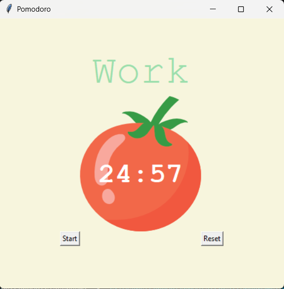

# Pomodoro Timer

A desktop Pomodoro timer built with Tkinter. Runs automatic work and break
cycles, tracks completed sessions with checkmarks, and resets cleanly.
No installation beyond Python required.

---

## How to run
```bash
# No external dependencies — uses Python standard library only
python main.py
```

Requires Python 3 with Tkinter (included by default on Windows and macOS).
On Linux: `sudo apt-get install python3-tk`

## Screenshot



> Add a screenshot of the running app here.
> In VS Code: run the app → Snipping Tool → save as `screenshot.png` in this folder.

---

## How it works

| Session | Duration |
|---|---|
| Work session | 25 minutes |
| Short break | 5 minutes |
| Long break (every 4th) | 20 minutes |

The timer cycles automatically. Each completed work session adds a checkmark ✔
below the timer so you can track progress at a glance.

## Features

- ▶️ Start button launches the first work session immediately
- 🔁 Automatically cycles: Work → Short Break → Work → Long Break
- ⏱️ Live countdown displayed as MM:SS
- 🎨 Background color changes to signal Work (red) vs Break (green/teal)
- ✅ Checkmarks accumulate for each completed work block
- 🔄 Reset button clears timer, checkmarks, and session count

## Stack
```
Python 3  ·  Tkinter  ·  math
```

---

## Author

Shaban Alam · [shabandev27@gmail.com](mailto: shabandev27@gmail.com)
Available for freelance Python automation work.